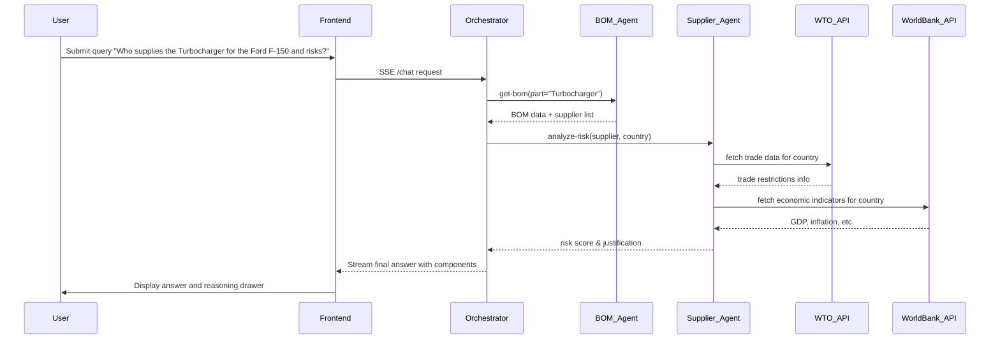

# Technical Architecture Documentation

## 1. Overview

The **Google Antigravity Test** project is a **multi‑agent AI orchestration platform** that demonstrates how autonomous agents can be dynamically discovered, registered, and coordinated to answer complex user queries. The system consists of a set of **backend micro‑services** (agents) written in **Python/FastAPI**, a **frontend UI** built with **Next.js (React)**, and an **Orchestrator** that routes user intents to the appropriate agent using **LLM reasoning**.

The architecture is deliberately modular and containerised, enabling independent scaling of each agent and straightforward extension with new capabilities.

---

## 2. Technology Stack & Rationale

| Layer | Technology | Reason for Choice |
|-------|------------|-------------------|
| **Backend Services** | **FastAPI** (Python) | High performance, async support, automatic OpenAPI docs, easy integration with LLM SDKs. |
| | **Docker** | Guarantees reproducible environments, isolates each agent, simplifies deployment and scaling via Docker‑Compose. |
| | **PostgreSQL & Neo4j** | PostgreSQL for relational data, Neo4j for graph‑based BOM relationships – each agent can choose the most suitable store. |
| **LLM Integration** | **OpenAI `gpt‑4o‑mini`** (or `gpt‑4.1‑mini`) for orchestration logic – low cost, fast response. | Provides robust reasoning and tool‑calling capabilities. |
| | **Google Gemini `gemini‑1.5‑flash`** for web‑search grounding in the Materials Agent. | Supports the `google_search_retrieval` tool for reliable, low‑latency search. |
| **Frontend** | **Next.js (React)** | Server‑side rendering, file‑based routing, built‑in CSS support, excellent developer experience. |
| | **Vanilla CSS + Tailwind (optional)** | Allows fine‑grained styling; the current UI uses custom glass‑morphism and micro‑animations for a premium look. |
| | **SSE (Server‑Sent Events)** | Enables real‑time streaming of LLM tokens and component events to the UI. |
| **Orchestration** | **LangChain** (OpenAI tools agent) | Simplifies creation of an LLM‑driven agent that can call tools (registered agents) dynamically. |
| **Protocol** | **Custom JSON protocol (`shared/protocol.py`)** | Defines `AgentCard`, `AgentSkill`, and `AGUIComponent` models for consistent communication between services and the UI. |

---

## 3. Scalability & Extensibility

1. **Containerised Micro‑services** – Each agent runs in its own Docker container. Horizontal scaling can be achieved by increasing the replica count in Docker‑Compose or migrating to Kubernetes.
2. **Stateless Orchestrator** – The orchestrator does not store session state; it streams responses directly, making it trivially scalable behind a load balancer.
3. **Dynamic Agent Registry** – Agents expose a `/.well‑known/agent.json` endpoint. On startup, the orchestrator fetches these definitions and builds a **tool registry** on‑the‑fly, allowing new agents to be added without code changes.
4. **Plug‑in Model Context Protocol** – The `AGUIComponent` includes an optional `id` field (run identifier). Frontend merges start/end events based on this ID, preventing UI flicker and ensuring accurate progress tracking.
5. **Separate Data Stores** – Agents can use the most appropriate database (e.g., Neo4j for graph queries, PostgreSQL for relational data). This decoupling avoids bottlenecks and enables independent optimisation.
6. **CI/CD Friendly** – All services are built with deterministic Docker layers; the repository can be integrated into any CI pipeline to run unit tests, linting, and automated deployments.

---

## 4. Agent Auto‑Registration & Discovery

### 4.1 Registration Flow
1. **Agent Startup** – Each agent registers itself with the orchestrator via a POST to `/register` providing an `AgentCard` payload (name, URL, version, skills).
2. **Registry Storage** – The orchestrator stores the card in an in‑memory `Registry` (`agents/orchestrator/registry.py`).
3. **Skill Exposure** – Skills are defined with an `id`, description, and JSON‑Schema parameters, enabling LangChain to generate correct tool calls.
4. **Dynamic Tool Creation** – `react_agent.py` reads the registry and creates a `StructuredTool` for each skill using the agent’s URL and skill ID.

### 4.2 Adding a New Agent
- Implement the FastAPI service exposing `/.well‑known/agent.json` and the required skill endpoints.
- Ensure the service calls the orchestrator’s `/register` endpoint on startup.
- No changes to the orchestrator code are required; the new tool appears automatically in the LLM’s toolbox.

---

## 5. Model‑Context Protocol & Plug‑in Architecture

The **model‑context protocol** is defined in `shared/protocol.py`:
- `AgentCard` describes an agent and its capabilities.
- `AGUIComponent` carries UI‑renderable data together with an optional `id` (run identifier).
- `AGUIMessage` aggregates components for a single user response.

**Plug‑in Points**:
1. **LLM Prompt** – The orchestrator’s system prompt (in `react_agent.py`) can be extended to include new orchestration rules or additional context.
2. **Component Types** – New UI components (e.g., charts, maps) can be added by extending `AGUIComponentType` and handling them in the React `ThinkingDrawer`.
3. **Tool Parameters** – Since each skill’s JSON schema is part of the `AgentCard`, the LLM automatically validates inputs, making it easy to add complex tools.

---

## 6. Agent Operation Details

| Agent | Primary Responsibility | API Endpoint | Example Skill |
|-------|------------------------|--------------|---------------|
| **Materials Agent** | Search the web for part details using Gemini grounding. | `POST /find-material` | `find-material` – returns OEM status, manufacturer, origin, price, and raw search context. |
| **BOM Agent** | Retrieve Bill‑of‑Materials from Neo4j. | `POST /get-bom` | `get-bom` – returns children parts and supplier list for a given part name. |
| **Supplier Agent** | Analyse geopolitical risk of suppliers using OpenAI. | `POST /analyze-risk` | `analyze-risk` – returns risk score and justification per supplier. |
| **Orchestrator** | Routes user queries, composes multi‑step plans, streams tokens and component events. | `POST /chat` | – |

Each agent is **stateless** (except for its own DB connections) and can be queried directly via its HTTP API, enabling **independent testing** and **fallback** usage.

---

## 7. Orchestrator Rules & Query Flow

1. **Receive User Message** – `/chat` endpoint streams the request to the LangChain agent.
2. **Tool Selection** – The LLM decides which tool(s) to call based on the system prompt and the user intent.
3. **Fallback Logic** – The prompt explicitly instructs the orchestrator to:
   - First attempt `get-bom` for part‑related queries.
   - If `get-bom` returns an error or empty result, automatically call `find-material` to obtain real‑world supplier data.
   - Finally, call `analyze-risk` on any discovered suppliers.
4. **Event Streaming** – `on_tool_start` and `on_tool_end` events are emitted with a stable `run_id`. The frontend merges these into a single UI step, removing the lingering spinner.
5. **Response Assembly** – After all tool calls complete, the LLM generates a final natural‑language answer, which is streamed token‑by‑token to the UI.

---

## 8. Separate Agent Querying

Because each agent exposes a standard FastAPI interface, developers can bypass the orchestrator and call an agent directly for debugging or batch processing:
```bash
curl -X POST http://localhost:8002/find-material -H "Content-Type: application/json" -d '{"part_name": "Turbocharger"}'
```
This decoupling also allows **micro‑service contracts** to evolve independently.

---

## 9. Security & Secret Management

- All secrets (OpenAI API key, Google API key) are stored in a `.env` file **ignored by Git**.
- The repository history was rewritten to remove any leaked keys before pushing to GitHub.
- Docker images are built without embedding secrets; they are injected at runtime via environment variables.

---

## 10. Future Extensions

- **Kubernetes Deployment** – Replace Docker‑Compose with Helm charts for production‑grade scaling and auto‑healing.
- **Additional Agents** – Plug in new domains (e.g., pricing, logistics) by implementing the `AgentCard` contract.
- **Observability** – Export Prometheus metrics from each container and integrate with Grafana dashboards.
- **Versioned Model Plugins** – Swap LLM providers by updating the system prompt and model configuration in `react_agent.py`.

---

## 11. References

- LangChain Documentation: https://python.langchain.com
- FastAPI Docs: https://fastapi.tiangolo.com
- Next.js Docs: https://nextjs.org/docs
- Google Gemini API: https://ai.google.dev/gemini-api

---

*Prepared for CTOs and Lead Architects to assess design decisions, scalability, and extensibility of the Google Antigravity Test platform.*
