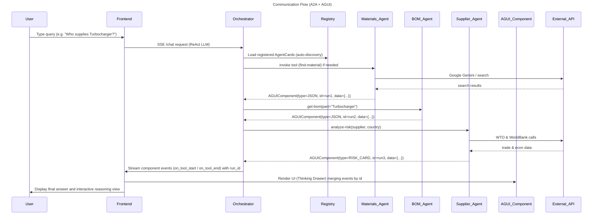

# Communication Flow Protocol (A2A + AGUI)

The diagram captures:
- **A2A (Agent‑to‑Agent)**: agents register via `AgentCard` and are invoked as tools by the ReAct orchestrator.
- **AGUI**: `AGUIComponent` objects (including the optional `id`) travel from the orchestrator to the frontend, enabling the Thinking Drawer to merge start/end events and present a coherent UI.
