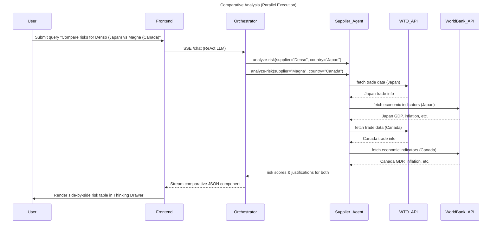

# Comparative Analysis (Parallel Execution)

```mermaid
sequenceDiagram
    title Comparative Analysis (Parallel Execution)
    participant User
    participant Frontend
    participant Orchestrator
    participant Supplier_Agent
    participant WTO_API
    participant WorldBank_API

    User->>Frontend: Submit query "Compare risks for Denso (Japan) vs Magna (Canada)"
    Frontend->>Orchestrator: SSE /chat (ReAct LLM)
    Orchestrator->>Supplier_Agent: analyze-risk(supplier="Denso", country="Japan")
    Orchestrator->>Supplier_Agent: analyze-risk(supplier="Magna", country="Canada")
    Supplier_Agent->>WTO_API: fetch trade data (Japan)
    WTO_API-->>Supplier_Agent: Japan trade info
    Supplier_Agent->>WorldBank_API: fetch economic indicators (Japan)
    WorldBank_API-->>Supplier_Agent: Japan GDP, inflation, etc.
    Supplier_Agent->>WTO_API: fetch trade data (Canada)
    WTO_API-->>Supplier_Agent: Canada trade info
    Supplier_Agent->>WorldBank_API: fetch economic indicators (Canada)
    WorldBank_API-->>Supplier_Agent: Canada GDP, inflation, etc.
    Supplier_Agent-->>Orchestrator: risk scores & justifications for both
    Orchestrator-->>Frontend: Stream comparative JSON component
    Frontend->>User: Render side‑by‑side risk table in Thinking Drawer
```
