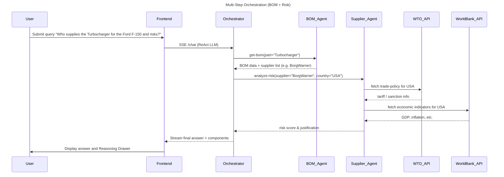

# Multi‑Step Orchestration (BOM + Risk)

```mermaid
sequenceDiagram
    title Multi-Step Orchestration (BOM + Risk)
    participant User
    participant Frontend
    participant Orchestrator
    participant BOM_Agent
    participant Supplier_Agent
    participant WTO_API
    participant WorldBank_API

    User->>Frontend: Submit query "Who supplies the Turbocharger for the Ford F‑150 and risks?"
    Frontend->>Orchestrator: SSE /chat (ReAct LLM)
    Orchestrator->>BOM_Agent: get-bom(part="Turbocharger")
    BOM_Agent-->>Orchestrator: BOM data + supplier list (e.g. BorgWarner)
    Orchestrator->>Supplier_Agent: analyze-risk(supplier="BorgWarner", country="USA")
    Supplier_Agent->>WTO_API: fetch trade‑policy for USA
    WTO_API-->>Supplier_Agent: tariff / sanction info
    Supplier_Agent->>WorldBank_API: fetch economic indicators for USA
    WorldBank_API-->>Supplier_Agent: GDP, inflation, etc.
    Supplier_Agent-->>Orchestrator: risk score & justification
    Orchestrator-->>Frontend: Stream final answer + components
    Frontend->>User: Display answer and Reasoning Drawer
```
