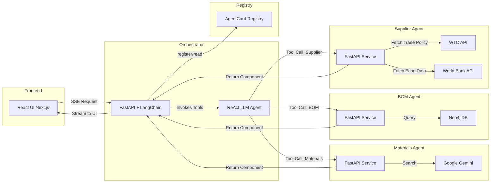

# Technology Stack & Agent Communication Diagram

The diagram illustrates:
- **Frontend** uses Next.js and receives streaming updates via SSE.
- **Orchestrator** runs a FastAPI service with a ReAct‑style LLM executor.
- **Agent Registry** stores `AgentCard` definitions for auto‑discovery.
- Each **Agent** is a FastAPI micro‑service exposing its skills as HTTP endpoints.
- **Materials Agent** leverages Google Gemini for web search.
- **BOM Agent** interacts with a Neo4j graph database.
- **Supplier Agent** calls external WTO and World Bank APIs for risk data.
- All agents return `AGUIComponent` messages (including `run_id`) that the Orchestrator streams back to the Frontend, where the Thinking Drawer merges events.
